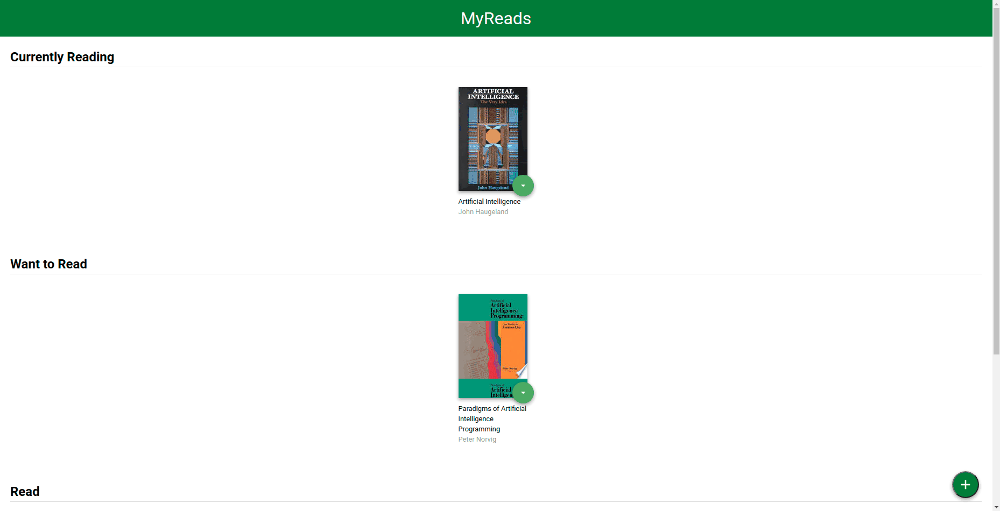

# Abdelhady's Fork of the MyReads Project - AFMP


## Description

This is a book lending web app based on the MyReads starter layout and styling provided by Udacity. This app was created using 'create-react-app' and uses JavaScript, React and an external API (provided by Udacity, as well), to categorize books into 3 shelves: Currently Reading, Want to Read and Read.

This app also makes use of routers to give the enduser the same natural feeling of browsing the web (as in having the forward and back options working, and states properly routed in the URL).

You can search books, add them to shelves or remove them by setting the shelf to 'none'.

## Visuals



## Quick Start

To get started developing right away:

* install all project dependencies with `npm install`
* start the development server with `npm start`

Don't forget to build the app for production before using it!

## File Structure
```bash
├── CONTRIBUTING.md
├── LICENSE
├── README.md - This file.
├── SEARCH_TERMS.md # The whitelisted short collection of available search terms for you to use with your app.
├── package.json # npm package manager file. It's unlikely that you'll need to modify this.
├── public
│   ├── favicon.ico # React Icon, You may change if you wish.
│   └── index.html # DO NOT MODIFY
└── src
    ├── App.css # Styles for your app. Feel free to customize this as you desire.
    ├── App.js # This is the root of your app. Contains static HTML right now.
    ├── App.test.js # Used for testing. Provided with Create React App. Testing is encouraged, but not required.
    ├── Book.js # This is the component that renders the book and retrieves book data from the parent component.
    ├── BooksAPI.js # A JavaScript API for the provided Udacity backend. Instructions for the methods are below.
    ├── ChangeShelf.js # This component allows the enduser to move the book to a different shelf.
    ├── CreateShelf.js # This component generates the shelf and renders all the books that adhere to it.
    ├── SearchBooks.js # This component allows the enduser to find a book (fetches from the BooksAPI) and add it to a shelf.
    ├── icons # Helpful images for your app. Use at your discretion.
    │   ├── add.svg
    │   ├── arrow-back.svg
    │   └── arrow-drop-down.svg
    ├── index.css # Global styles. You probably won't need to change anything here.
    └── index.js # You should not need to modify this file. It is used for DOM rendering only.
```

## Backend Server

```
NOTE: This section is provided by Udacity and is meant to explain how you can interact with the BooksAPI provided with this package.
```

To simplify your development process, we've provided a backend server for you to develop against. The provided file [`BooksAPI.js`](src/BooksAPI.js) contains the methods you will need to perform necessary operations on the backend:

* [`getAll`](#getall)
* [`update`](#update)
* [`search`](#search)

### `getAll`

Method Signature:

```js
getAll()
```

* Returns a Promise which resolves to a JSON object containing a collection of book objects.
* This collection represents the books currently in the bookshelves in your app.

### `update`

Method Signature:

```js
update(book, shelf)
```

* book: `<Object>` containing at minimum an `id` attribute
* shelf: `<String>` contains one of ["wantToRead", "currentlyReading", "read"]  
* Returns a Promise which resolves to a JSON object containing the response data of the POST request

### `search`

Method Signature:

```js
search(query)
```

* query: `<String>`
* Returns a Promise which resolves to a JSON object containing a collection of a maximum of 20 book objects.
* These books do not know which shelf they are on. They are raw results only. You'll need to make sure that books have the correct state while on the search page.

## Important
The backend API uses a fixed set of cached search results and is limited to a particular set of search terms, which can be found in [SEARCH_TERMS.md](SEARCH_TERMS.md). That list of terms are the _only_ terms that will work with the backend, so don't be surprised if your searches for Basket Weaving or Bubble Wrap don't come back with any results.

## Create React App

This project was bootstrapped with [Create React App](https://github.com/facebookincubator/create-react-app). You can find more information on how to perform common tasks [here](https://github.com/facebookincubator/create-react-app/blob/master/packages/react-scripts/template/README.md).

## License

Starter code (initial HTML and CSS, as well as the BooksAPI) are property of Udacity. The implementation of the app (using React and JS) as well as adding functionality to the existing layout and styling was created by me "Abdelhady" and is licensed under the GNU GPL v3 license included in this fork with the name 'LICENSE'.

Feel free to use this app as long as you mention Udacity for the layout and myself for implementing the functionality.

## Contributing

Read `CONTRIBUTING.md` for more info!
